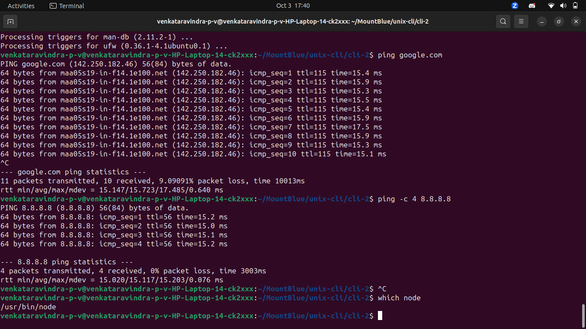
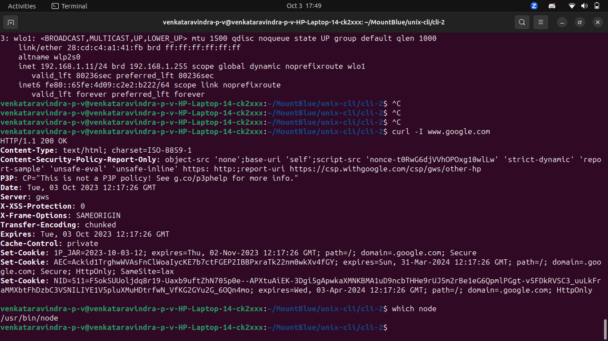

venkataravindra 

1.`head -n 3 book.txt` : To print the first three lines 
2.`tail -n 10 book.txt` : print the last 10 lines in the book

3.`grep -o -i "Harry" book.txt | wc -l`
`grep -o -i "Ron" book.txt | wc -l`
`grep -o -i "Hermione" book.txt | wc -l`
`grep -o -i "Dumbledore" book.txt | wc -l` 

Count the occurrences of specific words in the book

4. `sed -n '100,200p' book.txt` : print lines from 100 through 200 in the book

5. `tr -s '[:space:]' '\n' < book.txt | sort -u | wc -l` : Count the number of unique words in the book

<h1>Processes and ports</h1>

`pgrep -f "chrome"` : List the broweser ids 

`pkill -f "chrome"` : stop the browser application from the command line

`ps aux --sort=-%cpu | head -n 4` : list top procesers in cpu

`ps aux --sort=-%mem | head -n 4` : list top procesers in memory

`python -m http.server 8000`  : Start a Python HTTP server on port 8000

`pkill -f "python -m http.server 8000"` : Stop the python server and open in new tab

`python -m http.server 90` : to start a python server at port 90

`netstat -tuln` : display all active connection TCP/IP

`lsof -i :5432` : to find the pid of the process that is listening on port 5432
``

<h1>Managing software</h1>

`sudo apt update` 

`sudo apt install nginx` to install 

`sudo apt remove nginx`  to remove 

<h2>Misc</h2>

local IP address `ip addr` : 192.168.1.11/24 brd 192.168.1.255

IP address of google: `ping -c 4 8.8.8.8`

`curl -I www.google.com` :  to check if Internet is working using CLI

`which node` : to find the node 

